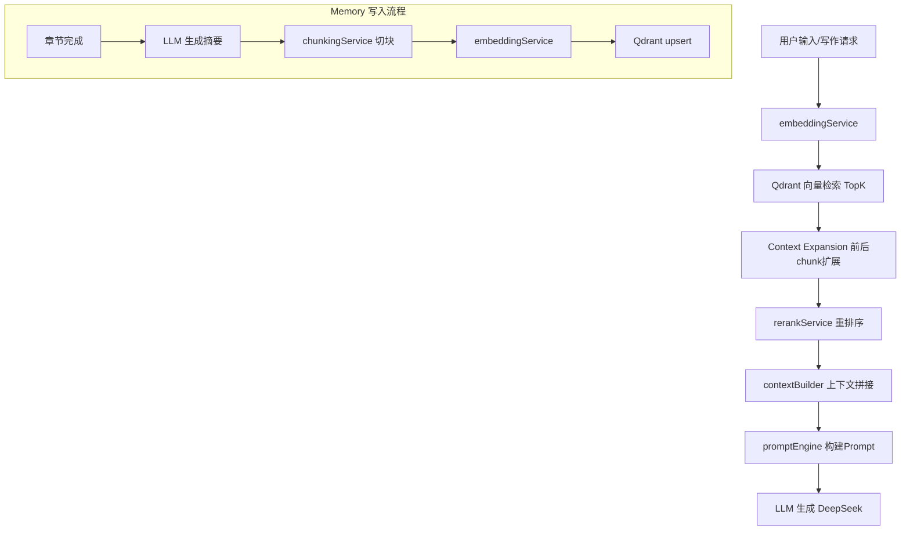

# RAG 系统生产级架构升级计划（Qdrant）

## 一、当前架构分析

现有 RAG 实现集中在 `[lib/ai/ragService.ts](lib/ai/ragService.ts)` 中，存在以下问题：

- **Embedding 为 mock**：`hashStringToVector()` 仅做字符哈希，无语义理解能力
- **向量存储为内存数组**：`inMemoryStore: MemoryRecord[]`，进程重启即丢失
- **无切块机制**：直接存储原始文本，无 overlap
- **无 Context Expansion**：仅返回匹配 chunk，无上下文扩展
- **无 Rerank**：仅按 cosine similarity 排序
- **无 Memory 写入**：章节完成后无自动摘要入库

调用链路：`writingEngine.ts` -> `ragService.searchMemory()` -> 内存数组遍历

## 二、目标架构




## 三、目录结构设计

```
lib/ai/
├── embedding/
│   └── embeddingService.ts       # OpenAI Embedding 封装
├── chunking/
│   └── chunkingService.ts        # 语义切块 + overlap
├── vectorStore/
│   ├── types.ts                  # VectorStore 抽象接口
│   ├── index.ts                  # 工厂函数 + 导出
│   └── qdrantStore.ts            # Qdrant 实现
├── retrieval/
│   └── retrievalService.ts       # 检索 + Context Expansion
├── rerank/
│   └── rerankService.ts          # Rerank 重排序
├── memory/
│   └── memoryService.ts          # Memory 写入（章节摘要 -> 向量化 -> 存储）
├── contextBuilder.ts             # 升级：集成 RAG pipeline
├── llmClient.ts                  # 不变
├── promptEngine.ts               # 不变
├── writingEngine.ts              # 适配新 RAG 接口
└── ragService.ts                 # 废弃，由新模块替代
```

## 四、模块详细设计

### 4.1 embeddingService.ts

- **职责**：调用 OpenAI `text-embedding-3-small` 生成语义向量
- **输入**：单条文本 `string` 或批量 `string[]`
- **输出**：`number[]` 或 `number[][]`
- **关键设计**：
  - `getEmbedding(text: string): Promise<number[]>`
  - `getEmbeddings(texts: string[]): Promise<number[][]>` — 内部按批次（如 20 条/批）调用，避免超限
  - 使用已有的 `openai` 依赖（`package.json` 中已有 `openai: ^6.31.0`）
  - 通过 `OPENAI_API_KEY` 环境变量认证

### 4.2 chunkingService.ts

- **职责**：将长文本按语义边界（段落/句子）切块，支持 overlap
- **输入**：`text: string`, `options: { chunkSize?: number, overlap?: number }`
- **输出**：`Chunk[]`，其中 `Chunk = { id: string, content: string, index: number }`
- **关键设计**：
  - 默认 `chunkSize=300`，`overlap=100`
  - 优先按 `\n\n`（段落）分割，段落过长则按句子（`。！？.!?`）再分
  - 每个 chunk 带递增 `index`，用于后续 Context Expansion

### 4.3 vectorStore/ — VectorStore 抽象 + Qdrant 实现

**types.ts** — 接口定义：

```typescript
interface VectorStore {
  ensureCollection(name: string, dimension: number): Promise<void>;
  upsert(collection: string, points: VectorPoint[]): Promise<void>;
  search(collection: string, vector: number[], options?: SearchOptions): Promise<SearchResult[]>;
  delete(collection: string, ids: string[]): Promise<void>;
}

type VectorPoint = {
  id: string;
  vector: number[];
  payload: Record<string, unknown>;
};

type SearchOptions = {
  topK?: number;
  scoreThreshold?: number;
  filter?: Record<string, unknown>;
};

type SearchResult = {
  id: string;
  score: number;
  payload: Record<string, unknown>;
};
```

**qdrantStore.ts** — Qdrant 实现：

- 使用 `@qdrant/js-client-rest` SDK
- `ensureCollection`：检查 collection 是否存在，不存在则创建（Cosine distance）
- `upsert`：批量写入向量点
- `search`：支持 topK + filter（如按 chapter 过滤）
- 连接配置通过 `QDRANT_URL` / `QDRANT_API_KEY` 环境变量

**index.ts** — 工厂函数：

- `getVectorStore(): VectorStore` — 当前返回 QdrantStore 单例，未来可根据配置切换 Pinecone 等

### 4.4 retrievalService.ts

- **职责**：完整检索流程 = Embedding -> Qdrant 查询 -> Context Expansion
- **输入**：`query: string`, `options: { collection, topK, chapter?, expandWindow? }`
- **输出**：`{ chunks: Chunk[], expandedText: string }`
- **关键设计**：
  1. 调用 `embeddingService.getEmbedding(query)` 获取查询向量
  2. 调用 `vectorStore.search()` 获取 topK 结果
  3. Context Expansion：根据每个命中 chunk 的 `index`，再从 Qdrant 取 `index-1` 和 `index+1` 的 chunk（同 chapter 内）
  4. 去重后拼接为 `expandedText`

### 4.5 rerankService.ts

- **职责**：对检索结果进行重排序，提高相关性
- **输入**：`query: string`, `chunks: SearchResult[]`, `options: { topN? }`
- **输出**：排序后的 `SearchResult[]`（取 topN）
- **关键设计**：
  - 实现基于 embedding similarity 的 rerank：对 query 和每个 chunk content 计算 cosine similarity 重新打分
  - 额外加入关键词命中加权：提取 query 关键词，chunk 包含关键词则加分
  - 设计为可替换（未来可接入 Cohere rerank API 或 cross-encoder 模型）

### 4.6 contextBuilder.ts 升级

- **职责**：在现有 world/characters/recent/memory 拼接基础上，集成完整 RAG pipeline
- **变更**：
  - 新增 `buildContextWithRAG(query, input)` 方法
  - 内部调用 `retrievalService` + `rerankService`
  - memory 片段标注来源 chapter：`[第3章] 林晓发现了隐藏的密室...`
  - 保持原有 `buildWritingContext()` 接口不变，扩展输入类型

### 4.7 memoryService.ts

- **职责**：章节完成后，自动生成摘要并写入向量库
- **流程**：
  1. 调用 LLM（`callChatModel`）生成章节摘要
  2. 调用 `chunkingService` 对摘要 + 原文关键段落切块
  3. 调用 `embeddingService.getEmbeddings()` 批量生成向量
  4. 调用 `vectorStore.upsert()` 写入 Qdrant
- **输入**：`{ chapterContent: string, chapterTitle: string, chapterId: string }`
- **输出**：`{ chunksStored: number }`

### 4.8 writingEngine.ts 适配

- 将 `buildContextWithRag()` 内部的 `searchMemory()` 替换为调用新的 `contextBuilder.buildContextWithRAG()`
- 删除对旧 `ragService.ts` 的导入

### 4.9 API 路由调整

- `[app/api/write/route.ts](app/api/write/route.ts)` 和 `[app/api/chat/route.ts](app/api/chat/route.ts)`：将 `runtime = "edge"` 改为 `runtime = "nodejs"`，因为 Qdrant SDK 需要 Node.js 运行时
- 新增 `app/api/memory/route.ts`：POST 接口，接收章节内容，触发 Memory 写入

## 五、环境变量设计

在 `.env.local` 中新增：

```
QDRANT_URL=http://localhost:6333
QDRANT_API_KEY=
OPENAI_API_KEY=
OPENAI_EMBEDDING_MODEL=text-embedding-3-small
```

保留现有：

```
DEEPSEEK_API_KEY=...
DEEPSEEK_BASE_URL=...
```

## 六、依赖新增

- `@qdrant/js-client-rest` — Qdrant Node.js SDK

## 七、部署设计（阿里云）

Qdrant Docker 启动：

```bash
docker run -d --name qdrant \
  -p 6333:6333 -p 6334:6334 \
  -v /data/qdrant:/qdrant/storage \
  qdrant/qdrant:latest
```

Node.js 连接远程 Qdrant：

- 生产环境设置 `QDRANT_URL=http://<阿里云内网IP>:6333`
- 如需公网访问，配置 Qdrant API Key 并设置 `QDRANT_API_KEY`

## 八、实施顺序

分 7 步实施，每步完成后可独立验证：

1. **基础设施**：安装依赖 + 环境变量 + 类型定义
2. **embeddingService**：OpenAI Embedding 封装
3. **chunkingService**：语义切块 + overlap
4. **vectorStore**：抽象接口 + Qdrant 实现
5. **retrievalService + rerankService**：检索 + 扩展 + 重排序
6. **contextBuilder 升级 + memoryService**：上下文集成 + Memory 写入
7. **writingEngine 适配 + API 路由**：串联完整链路 + 新增 memory API

