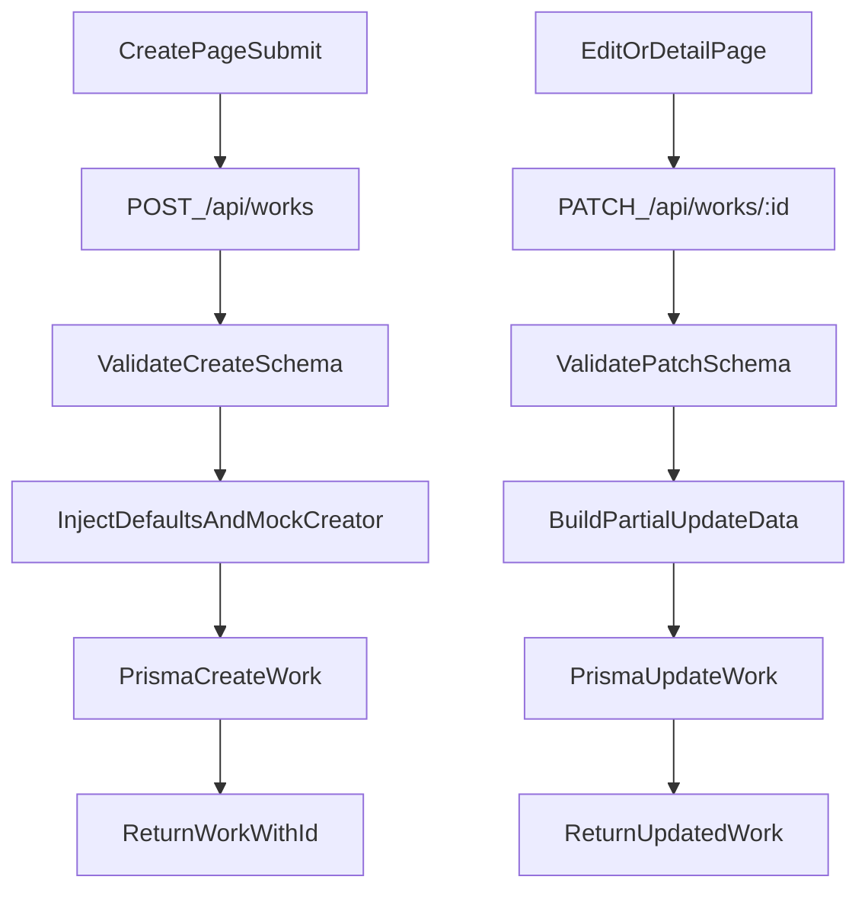

# 作品创建与更新接口改造计划

## 目标

- 以创建页真实输入为准收敛后端字段，移除未使用字段。
- 创建作品时自动初始化：作品名称=`未命名作品`、封面=`""`（空字符串）、生成作品ID。
- 在无多租户场景下，mock 创建人字段：`creatorId`、`creatorName`。
- 提供 `PATCH /api/works/:id`，支持全量或部分字段更新（仅改传入字段）。

## 前端字段对齐结论

- 创建页当前提交核心字段来自 [createNovel.tsx](/Users/lwcai/Desktop/ai-writing-assistant/components/create/createNovel.tsx)：
  - `category`、`theme`、`world`
  - `characters[]`（含 `name`、`personality`、`gender`、`age`、`roleArchetype`、`abilities`、`relationships`、`speechStyle`、`background`）
- 当前 `works` 接口里的 `audience`、`tags`、`meta` 未在该页面使用，可先移除或降级为可选扩展字段。

## 实施步骤

1. 更新 Prisma 数据模型 [schema.prisma](/Users/lwcai/Desktop/ai-writing-assistant/prisma/schema.prisma)

- 扩展 `Character` 结构匹配前端角色字段。
- 调整 `Work` 字段：
  - 保留：`category`、`theme`、`world`、`characters`。
  - 新增：`title`（默认 `未命名作品`）、`cover`（默认空字符串）、`creatorId`、`creatorName`。
  - 移除：`audience`、`tags`、`meta`（如需兼容可临时保留为 optional）。
- 保留 `createdAt`、`updatedAt`。

1. 重构创建接口 [app/api/works/route.ts](/Users/lwcai/Desktop/ai-writing-assistant/app/api/works/route.ts)

- `POST /api/works`：
  - 使用 zod 校验仅当前需要字段。
  - 写入时强制默认值：`title: "未命名作品"`、`cover: ""`。
  - 写入 mock 创建人：`creatorId: "mock-user-001"`、`creatorName: "Mock User"`。
  - 返回创建成功对象（含生成的 `id`）。

1. 新增更新接口 [app/api/works/[id]/route.ts](/Users/lwcai/Desktop/ai-writing-assistant/app/api/works/[id]/route.ts)

- `PATCH /api/works/:id`：
  - `params.id` 必填校验。
  - 请求体采用“全部字段 optional”的 patch schema。
  - 组装 Prisma `data` 时只放入请求中出现的字段，避免覆盖未传字段。
  - 当 body 为空或无有效字段时返回 400。
  - 不允许修改系统字段（如 `id`、`createdAt`）。

1. 数据层与类型同步

- 重新生成 Prisma Client（`prisma generate`），确保 API 可使用新字段类型。
- 修复受模型变更影响的类型错误（若有）。

1. 验证与回归

- 创建接口验证：
  - 只传前端字段，检查默认 `title`、`cover`、mock 创建人是否写入。
- 更新接口验证：
  - 仅传一个字段（如 `title`）时，仅该字段变化。
  - 传多字段时可全量更新。
  - 无效 `id` 与空 patch body 的错误响应正确。

## 建议补充字段（可选）

- `status`：作品状态（如 `draft`/`published`），默认 `draft`。
- `summary`：作品简介，便于列表展示。
- `deletedAt`：软删除预留字段（后续可做回收站）。

