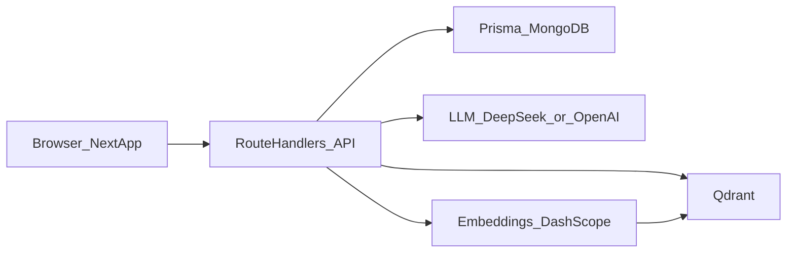

# AI 写作助手（ai-writing-assistant）

私有项目，当前代码不对外分发；若未来开源，请另行补充开源协议（`LICENSE`）与贡献说明。

面向小说/长篇创作的 Web 应用：作品与世界观搭建、章节编辑、AI 续写/润色，以及侧边栏内的列表与对话能力；并结合向量检索做上下文记忆（需 Qdrant + 嵌入模型）。

## 功能概览

- **作品（Work）**：类型、主题、世界观文本、角色列表（Prisma 内嵌 `Character` 类型）
- **章节（Chapter）**：正文、字数、摘要与结构化摘要、简单历史记录
- **创作页**：`/create` 新建作品设定；`/novels` 作品列表；`/writing/[id]` 写作与助手
- **AI**：`/api/write` 流式续写与润色（`WritingMode`：`continue` / `polish`）；`/api/chat` 对话；记忆相关 `/api/memory`
- **检索**：章节内容可向量化并写入 Qdrant；嵌入默认走阿里云 DashScope（OpenAI 兼容接口）

## 技术栈

| 类别 | 技术 |
|------|------|
| 框架 | Next.js 16（App Router）、React 19、TypeScript |
| UI | Tailwind CSS 4、shadcn/ui、Radix / Base UI 等 |
| 数据 | Prisma 6、**MongoDB**（事务需副本集） |
| 向量 | Qdrant（`@qdrant/js-client-rest`） |
| LLM | Vercel AI SDK、`@ai-sdk/openai` / `@ai-sdk/deepseek`，及自封装 `fetch` 补全 |
| 其他 | SWR、Zod、jieba 分词等 |

## 架构简述



## 环境要求

- **Node.js**：建议与 `@types/node` 一致的主流 LTS（如 20+）
- **包管理**：仓库使用 `pnpm`（见 `pnpm-lock.yaml`）
- **Docker**：用于本地 MongoDB 副本集 与 Qdrant（见 `docker-compose.yml`）

## 快速开始

### 1. 安装依赖

```bash
pnpm install
```

### 2. 启动 MongoDB 与 Qdrant

```bash
pnpm qdrant:up
# 或
docker compose up -d
```

- MongoDB：`27017`，镜像内通过 `init-mongo.js` 初始化单节点副本集 `rs0`（供 Prisma 使用）。
- Qdrant：`6333`（HTTP）、`6334`（gRPC）。

一键开发（先起容器再起 Next）：

```bash
pnpm dev:full
```

### 3. 配置环境变量

在项目根目录创建 `.env` 或 `.env.local`（不要提交密钥），至少包含：

| 变量 | 说明 |
|------|------|
| `DATABASE_URL` | MongoDB 连接串，需与副本集配置一致（例如指向 `127.0.0.1:27017`，并包含 `replicaSet=rs0` 等参数，具体以你的库名为准） |
| `LLM_PROVIDER` | `deepseek`（默认）或 `openai` |
| `DEEPSEEK_API_KEY` | DeepSeek 时必填（未设置时部分接口会返回模拟占位文案，见 `lib/ai/llmClient.ts`） |
| `DEEPSEEK_BASE_URL` | 可选，默认 `https://api.deepseek.com/v1/chat/completions` |
| `OPENAI_API_KEY` | `LLM_PROVIDER=openai` 时使用 |
| `OPENAI_BASE_URL` | 可选，兼容 OpenAI 协议的其他网关 |
| `OPENAI_MODEL` | 可选，覆盖默认模型名 |
| `DASHSCOPE_API_KEY` | **向量嵌入**必填（`lib/ai/embedding/embeddingService.ts`） |
| `DASHSCOPE_BASE_URL` | 可选 |
| `DASHSCOPE_EMBEDDING_MODEL` | 可选，默认 `text-embedding-v4` |
| `QDRANT_URL` | 可选，默认 `http://localhost:6333` |
| `QDRANT_API_KEY` | 云托管 Qdrant 时填写 |

### 4. 账号与多租户（Auth）

本项目已引入 Auth.js（NextAuth）账号体系，并按“每用户一租户”隔离数据：

- **登录与注册（合并）**：`/login` 使用邮箱 + 密码表单；提交后调用 `POST /api/auth/sign-in-or-up`：若邮箱未注册则自动创建账号并设置密码，若已注册则校验密码，成功后再执行 Credentials 登录。亦可选用 **GitHub** 登录（需配置环境变量，见下文）。
- **兼容旧接口**：`POST /api/auth/register` 仍为显式注册；`/register` 会重定向到 `/login`。
- 默认昵称（邮箱注册时）：`游客` + 8 位随机十六进制串。
- 未登录访问受保护页面会跳转登录页，并携带 `redirectUrl` 回跳参数。
- 多租户隔离：与作品/章节/写作/记忆相关的接口会以 `session.user.id` 作为租户边界，只允许读取/修改归属于当前用户（例如 `Work.creatorId` 过滤）。
- 资料修改：`PATCH /api/me` 可修改 `displayName`，并同步更新该用户下已有作品的 `creatorName`。

#### Auth 相关环境变量

| 变量 | 说明 |
|------|------|
| `AUTH_SECRET` / `NEXTAUTH_SECRET` | 用于 Auth.js 会话签名（生产部署务必配置；本地未配置时有开发兜底） |
| `AUTH_URL` | 生产环境站点根 URL（例如 `https://your-domain.com`），OAuth 回调依赖正确的主机名 |
| `AUTH_GITHUB_ID` / `AUTH_GITHUB_SECRET` | GitHub OAuth App 的 Client ID / Secret；配置后服务端会启用 GitHub 登录 |
| `NEXT_PUBLIC_GITHUB_AUTH` | 设为 `1` 时在登录页展示「使用 GitHub 继续」按钮（需与上一项同时配置） |

### 5. Prisma 与数据库

```bash
pnpm exec prisma generate
# 按你团队流程选择：db push / migrate（Mongo 场景以项目实际为准）
```

### 6. 启动开发服务器

```bash
pnpm dev
```

浏览器访问 Next 默认地址（通常为 `http://localhost:3000`）。

## 常用脚本

| 命令 | 作用 |
|------|------|
| `pnpm dev` | 开发模式 |
| `pnpm build` / `pnpm start` | 生产构建与启动 |
| `pnpm lint` | ESLint |
| `pnpm qdrant:up` / `pnpm qdrant:down` | 启停 Compose 服务 |
| `pnpm dev:full` | Docker 后台 + `next dev` |

## 主要路由与 API

**页面（节选）**

- `/`：落地页
- `/novels`：作品列表
- `/create`：创建作品/设定
- `/writing/[id]`：写作工作台
- `/chat`：对话（布局见 `app/(with-sidebar)/`）

**API（`app/api`）**

- `novels`、`novels/[id]`：作品 CRUD
- `chapters`、`chapters/[id]`：章节
- `world`、`character`：世界观与角色相关
- `write`：写作生成（流式）
- `chat`：对话
- `memory`：记忆/向量相关

## 目录结构（高层）

- `app/`：App Router 页面与 Route Handlers
- `components/`：UI 与写作/聊天等业务组件
- `lib/ai/`：LLM、提示词、检索、向量、摘要等
- `lib/db/`：Prisma 客户端
- `prisma/`：数据模型
- `contexts/`、`hooks/`：前端状态与复用逻辑

## 已知说明

- 生产构建下 `next.config.ts` 会移除 `console`（`compiler.removeConsole`）。
- 嵌入与向量能力依赖 `DashScope + Qdrant`；仅跑 LLM 时仍建议配置好数据库连接。

## 许可与协作

- 当前为 **私有仓库**；若改为 Public，请补充许可证文件及贡献/安全披露说明。

---

（可选）截图、`DATABASE_URL` 示例连接串、部署平台（Vercel / 自建）可在该节后补全。

## GitHub Actions 自动部署到阿里云（PM2）

当 PR 合并到 `main` 分支后，工作流会自动构建并发布到服务器：

1. 安装依赖并执行 `pnpm build`（开启 Next `standalone` 输出）
2. 打包 `.next/standalone`、`.next/static`、`public`、`ecosystem.config.js`、`scripts/deploy.remote.sh` 等运行文件
3. 通过 SSH 上传到阿里云
4. 远端执行部署脚本，链接静态资源后切换 `current` 并 `pm2 startOrReload`（无需 `pnpm install`）

### 仓库内新增文件

- 工作流：`.github/workflows/deploy.yml`
- PM2 配置：`ecosystem.config.js`
- 远端部署脚本：`scripts/deploy.remote.sh`

### GitHub Secrets

在仓库 `Settings -> Secrets and variables -> Actions` 中添加：

| Secret | 说明 |
|------|------|
| `ALIYUN_HOST` | 服务器地址 |
| `ALIYUN_PORT` | SSH 端口（默认 `22`） |
| `ALIYUN_USER` | SSH 用户 |
| `ALIYUN_SSH_KEY` | 用于部署的私钥（建议专用部署密钥） |
| `DEPLOY_PATH` | 服务器部署目录（示例：`/var/www/ai-writing-assistant`） |
| `APP_ENV_PRODUCTION` | 必填，多行文本，内容为完整 `.env.production`（部署时会直接覆盖服务器上的 `shared/.env.production`） |

### 服务器一次性准备

确保服务器已安装 Node.js、pnpm、pm2，并执行：

```bash
mkdir -p /var/www/ai-writing-assistant/shared/logs
mkdir -p /var/www/ai-writing-assistant/releases
```

环境变量不需要在服务器手工维护。请将完整 `.env.production` 内容放到 GitHub Secret `APP_ENV_PRODUCTION`（支持多行），工作流每次部署会自动下发到 `${DEPLOY_PATH}/shared/.env.production`。

设置 PM2 开机自启（首次手工执行一次）：

```bash
pm2 startup
pm2 save
```

### 部署目录结构

```text
${DEPLOY_PATH}
├── current -> releases/<sha>
├── release-<sha>.tar.gz
├── releases/
│   └── <sha>/
└── shared/
    ├── .env.production
    └── logs/
```

### 回滚示例

如果需要回滚到旧版本（`<old_sha>`）：

```bash
ln -sfn /var/www/ai-writing-assistant/releases/<old_sha> /var/www/ai-writing-assistant/current
APP_CWD=/var/www/ai-writing-assistant/current pm2 startOrReload /var/www/ai-writing-assistant/current/ecosystem.config.js --update-env
```
